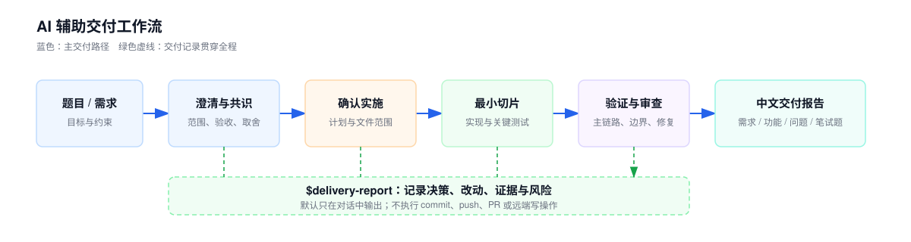

# AI 辅助交付工作流

一套面向日常开发、限时编码和产品技术讨论的透明工作流。它帮助你更快完成“澄清 → 决策 → 实现 → 验证”，但不会替你做关键判断。



`$delivery-report` 作为伴随 skill 记录关键决策、实际改动、验证证据与风险，并在结束时按任务类型生成中文报告。整个工作流不会执行 commit、push、PR 或远端写操作。

## 项目结构

以下结构基于当前工作区生成，省略 `.git/`、`node_modules/` 与 `dist/`：

```text
.
├── .agents/
│   └── skills/                       # Codex 可发现的 skill 镜像及元数据
├── .gitignore
├── AGENTS.md                         # 项目级工作流与协作约定
├── README.md
├── coding-workflow.md                # 可复用的 AI 辅助交付流程
├── docs/
│   └── assets/
│       └── delivery-workflow.svg
├── examples/
│   └── scheduler-guided-delivery-demo.md
├── install-codex.sh                   # 安装 skills 到 Codex (~/.codex/skills)
├── install-claude.sh                  # 安装 skills 到 Claude Code (~/.claude/skills)
├── install-common.sh                  # 安装脚本共享逻辑（被上面两个 source）
├── react/                             # React + Vite 示例
│   ├── src/
│   │   ├── test/setup.ts
│   │   ├── App.test.tsx
│   │   ├── App.tsx
│   │   ├── App.css
│   │   ├── index.css
│   │   └── main.tsx
│   ├── index.html
│   ├── package.json
│   ├── pnpm-lock.yaml
│   ├── tsconfig.app.json
│   ├── tsconfig.json
│   ├── tsconfig.node.json
│   └── vite.config.ts
├── server/                            # 独立 Fastify + TypeScript API 模板
│   ├── src/
│   │   ├── app.ts                     # 路由与统一错误处理
│   │   └── index.ts                   # 服务启动入口
│   ├── test/
│   │   └── app.test.ts                # API 契约测试
│   ├── package.json
│   ├── package-lock.json
│   └── tsconfig.json
├── skills/                            # 工作流 skill 源码
│   ├── debug-loop/
│   ├── delivery-report/
│   ├── engineering-review/
│   ├── feature-slice/
│   ├── guided-delivery/
│   └── mvp-delivery/
├── test.md
└── vue/                               # Vue + Vite 示例
    ├── src/
    │   ├── App.spec.ts
    │   ├── App.vue
    │   ├── App.css
    │   ├── index.css
    │   └── main.ts
    ├── index.html
    ├── package.json
    ├── pnpm-lock.yaml
    ├── tsconfig.app.json
    ├── tsconfig.json
    ├── tsconfig.node.json
    └── vite.config.ts
```

## 极简 Node API 模板

[`server/`](server/) 是一个可独立运行的 Fastify + TypeScript API 起点，提供统一 JSON 响应格式：

- `GET /health`：服务健康状态；
- `GET /api/v1/hello`：示例业务接口；
- 其他路径：统一 JSON 404 响应。

启动开发服务：

```bash
cd server
npm install
npm run dev
```

常用命令：

```bash
npm test        # 运行 API 契约测试
npm run build   # 编译到 dist/
npm start       # 启动编译产物
```

## 两种使用方式

### 在本仓库中使用

`AGENTS.md` 是项目级默认指令：进入本仓库的 Codex 会先读取工作流，并按任务选择 `skills/` 中的对应流程。完整提示词和 30 分钟节奏见 [coding-workflow.md](coding-workflow.md)。

### 在任意仓库中调用 `$skill`

将 skills 安装到 Codex 或 Claude Code 的全局发现目录：

```bash
./install-codex.sh      # 安装到 ~/.codex/skills
./install-claude.sh     # 安装到 ~/.claude/skills
```

也可以指定自己的 skills 目录：

```bash
./install-codex.sh /path/to/skills
./install-claude.sh /path/to/skills
```

安装脚本不会联网或安装依赖。若目标已有同名 skill，会先创建带时间戳的备份，再复制新版本。

安装后，重启或新开 Codex 会话。完整任务优先显式调用：

```text
$guided-delivery

我需要在 30 分钟内交付一个 React + Node.js 的最小功能。
```

它会一次只问一个影响设计的问题，并给出推荐答案；形成目标路径、范围、API/状态、边界、验收测试与计划的共识记录后，等待你输入“确认实施”，才会写代码。

可用 skills：

- `$guided-delivery`：完整入口；一问一答达成共识，确认后实施、验证和审查。
- `$mvp-delivery`：将模糊需求收敛为可验证的最小交付。
- `$feature-slice`：在已有代码库中实现一条最小端到端功能。
- `$engineering-review`：按风险优先级审查当前变更。
- `$debug-loop`：基于证据定位问题、最小修复并回归验证。
- `$delivery-report`：伴随全流程记录关键事实，并输出需求、功能、问题或笔试题报告。

## 排序题示例

```text
$guided-delivery

题目要求实现“复杂度尽可能低”的排序，语言是 TypeScript，限时 30 分钟。先不要写代码。

请先判断“最低复杂度”是指时间、空间、稳定性还是特定输入约束；一次只问一个关键问题并给出推荐答案。说明比较排序的通用时间下界，并列出数据类型、取值范围、负数、重复值、数据规模、原地排序和稳定性这些必须确认的边界。

形成共识记录后，等待我输入“确认实施”再写代码。
```

如果题目未给出整数范围等特殊约束，通用比较排序无法优于 `O(n log n)`；不要把计数排序或基数排序当成无条件更优的答案。

## 完整对话示例

- [Scheduler 的 `$guided-delivery` 对话演示](examples/scheduler-guided-delivery-demo.md)
